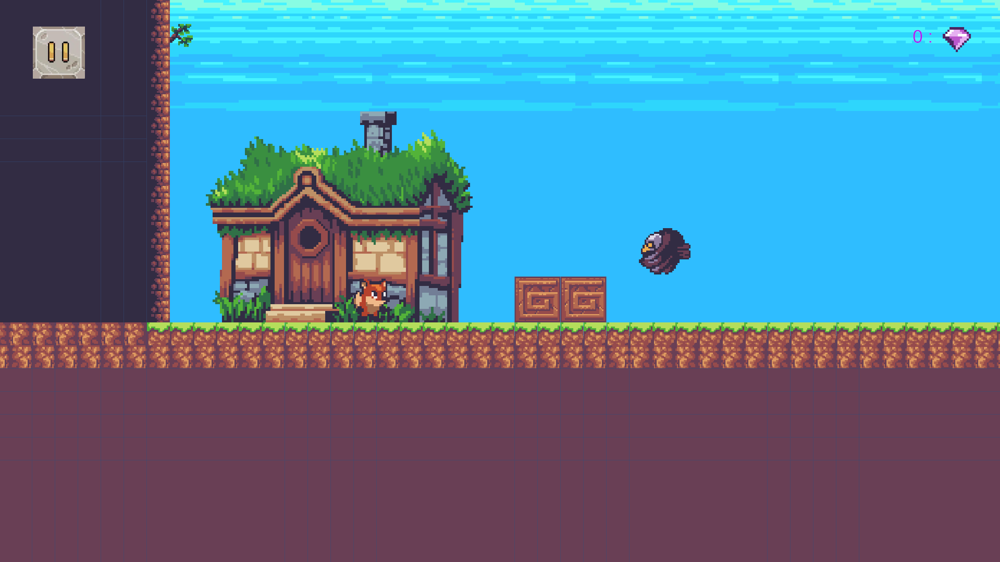
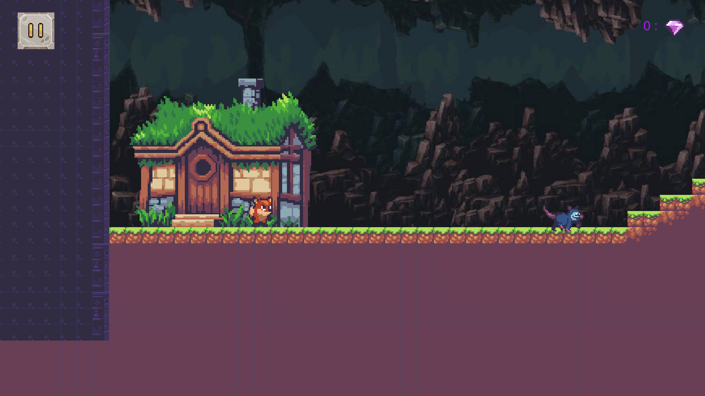
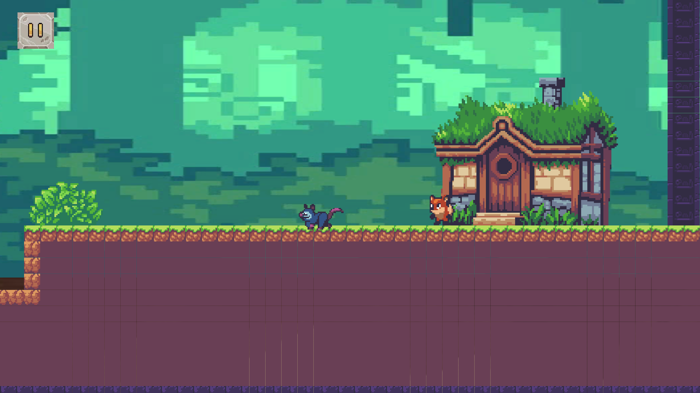

# 🎮 First 2D Unity Game

This is my **fully finished 2D game built with Unity and C#**.  
It has **3 levels**, a **pause menu**, and polished gameplay.  
I built it from start to finish and learned a lot along the way.

---

## 🕹️ Gameplay
- Play through **3 levels**  
- **Pause menu** to stop the game anytime  
- Simple and fun 2D gameplay

---

## 🛠️ Tools & Technologies
- Unity (2D)  
- C#  
- Visual Studio  

---

## 💭 What I Learned
While making this game, I learned:  
- The **basics of Unity** and how the editor works  
- How to structure a Unity project  
- Implement multiple levels and game logic  
- How to create a **pause menu**  
- How to polish a game from start to finish  

---

## ▶️ Play the Game
You can download the full Windows build here:  
🔗 [Download link here](https://drive.google.com/file/d/1mWqLrQO4ONp5lnAbvHZXcUh3yWQ7g1NS/view?usp=sharing)  

🕹 Extract the files and run the `.exe` and enjoy.

---

## 📸 Screenshots

   

 
 

---

Made with ❤️ while learning **Unity basics** and improving my C# skills.  
More projects coming soon! 🚀
